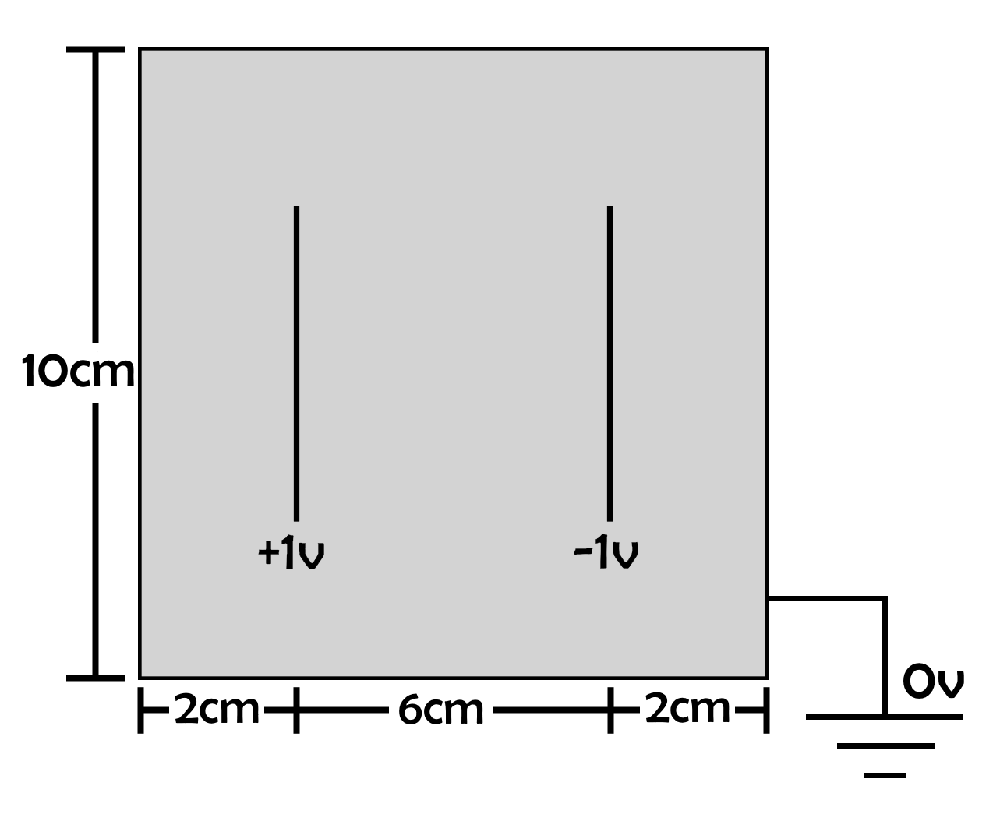
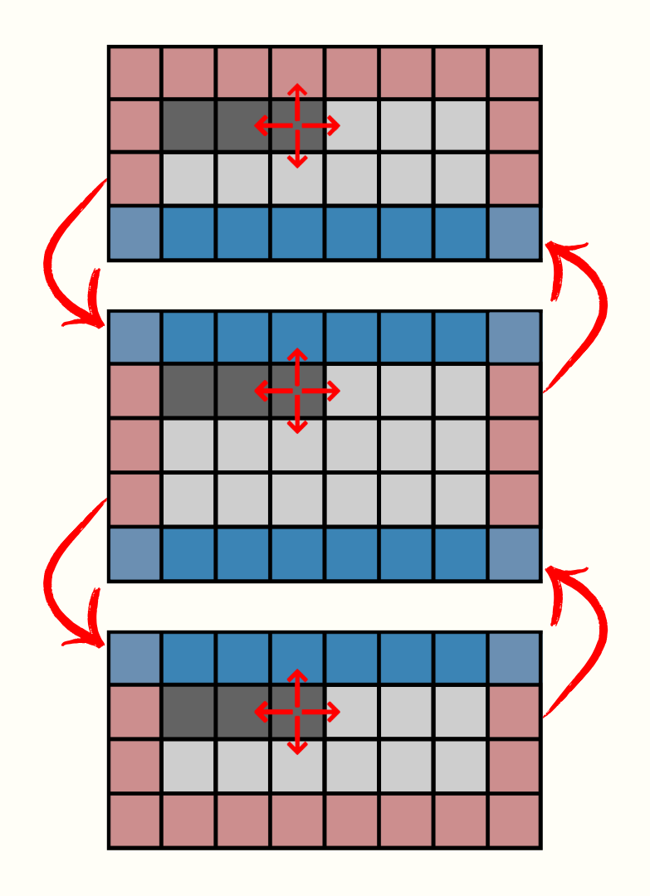

# Explicación de métodos de paralelización: Memoria compartida y Distribuida
div style="text-align: center;">
    

## Memoria Compartida: Método de Wavelength

Este método se ve utilizado para calculos reiterativos, para el caso del capacitor simple se comienza en el primer elemento de la grilla, ubicado en (0,0), y se procesan de diagonal en diagonal, en este caso se utliza una diagonal creciente la cual se encuentra fijada por el punto que pertenece a la columna 0; este método al tratar con datos de las diagonales asegura una no interdependencia.

Este método presenta multiples ventajas, al ser datos independiente se da una paralelización altamente eficiente, asimismo esta metodología presenta una execlente escalabilidad donde es altamente eficiente para grillas grandes y multiples procesadores. Asimismo presenta ciertas desventajas como el hecho de que es aplicable siempre y cuando sea organizable en diagonales, de igual manera puede presentar carga desbalanceada, donde segun el número de hilos que se esten usando en las primeras iteraciones al tener pocos datos puede tener un subaprovechamiento.
div style="text-align: center;">
    

## Memoría Distribuida: Método de Celdas Fantasmas

Este método se utiliza cuando al dividir un grilla en diferentes secciones asignadas cada una a un proceso diferente los datos presentan interdependencia a los valores de un proceso vecino, de esta manera surge la necesidad de una comunicación entre ellos y esto se resuelve añadiendo celdas que almacenaran los datos necesarios de otro proceso. Dicha metodología presenta una serie de ventajas como lo son la reducción de la reducción de la comunicación  entre procesos, de igual manera presenta una excelente escalabilidad conforme se añaden nodos lo que hace que sea estable.

Por otro lado tambien se presentan desventajas tales como que las celdas fantasmas aumentan la cantidad de almacenamiento utlizado debido a que se necesitan datos adicionales, asimimsmo su implementacion puede implicar un nivel de dificultad alto, asimismo la sincronización de datos puede tornarse problemática.
div style="text-align: center;">
    

# Metodos numéricos estudiados para la resolución del problema

Para la resolución del problema en cuestión se estarán utilizando mayormente métodos iterativos dentro de los cuales se implementa la metodología de diferencias finitas. Se escogen diferencias centrales ya que de esta manera se pueden aliviar parcialmente los errores de punto flotante que se acumulan en las iteraciones.

## Relajación de Jacobi 
El método de relajación de Jacobi consiste ne el uso de diferencias centrales para discretizar la ecuación diferencial inicial. Esto da como resultado que cada unos de los puntos de la grilla toma los puntos próximos para calcularse, tal como se puede ver en la siguiente ecuación.
\begin{equation}
\phi (x,y) = \frac{1}{4} \cdot \phi (x +a, y) + \phi (x -a,y) + \phi (x,y + a) + \phi (x,y - a)
\end{equation}
En el cual, $\phi (x, y)$ representa cada uno de los puntos de la grilla por los que se iterará
Computacionalmente, se crea una nueva copia de la grilla para guardar los diferentes valores que se calcularán en la implementación del método si guiendo la ecuaci'on anteriormente mostrada.

## Sobre-relajación de Jacobi (overrelaxation)
Este método es una forma sencilla de optimizar el método de relajación de Jacobi. En el cual se hará uso de un parámetro $\omega$ para lograr una convergencia acelerada, la ecuación para calcular cada uno de los puntos de la grilla es la siguiente.
$$
\phi_{prime} = (1+\omega)(\phi (x +a, y) + \phi (x -a,y) + \phi (x,y + a) + \phi (x,y - a)) - \omega \phi (x,y)
$$
### Error en Sobre-relajación de Jacobi
Como se sabe, a nivel matemático se intenta resolver un sistema de ecuaciones de forma $Ax=b$ en los que, con cada iteración, se conseguirá un vector solución aproximado $\bar{x}$. De esta manera el vector residual definido como $r = A\bar{x} - b$ debería ir acercandose a 0. A nivel numérico esto no siempre se cumple si la matriz a resolver está mal condicionada.
Para saber si una matriz esta malc condicionada se debe analizar el número de condición el cual se define de la siguiente manera.
\begin{equation}
\kappa (A) = ||A|| \cdot ||A^{T}||
\end{equation}
En que ||A|| se conoce como la norma espectral y corresponde a el mayor valor singular de la matriz $AA^{T}$. Para el caso de la matriz de este problema, esta misma es simétrica, por lo que el mayor valor singular corresponde a el mayor autovalor de la matriz.
El número de condición es un nos da información de la seguridad que tiene una matriz de estar bien condicionada, si este número es cercano a 1 la matriz esta bien condicionada, por lo que no habría problemas. Si este numero es mayor a 1 existe la posibilidad de que sea una matriz mal condicionada y que por lo tanto sea sensible a errores numéricos, lo que hace el método inestable.
### Nota importante
Cada problema posee condiciones distintas por los que se tiene que analizar por separado cada problema para identificar si el método numérico es estable. 
# Método de Gauss-Seidel
Nuevamente tenemos una optimización del método de relajación de Jacobi en el cual no se necesitará una copia de la grilla para asignar los valores que se calculen en la iteración. Los mismos valores de la grilla se irán actualizando dentro del mismo arreglo. Existe tambien una forma modificada de este método la cual atiende a la misma ecuación que el método sobre-relajación de Jacobi. A pesar de los errores anteriormente mencionados, Gauss Seidel demuestra ser más robusta frente matrices mal condicionadas
